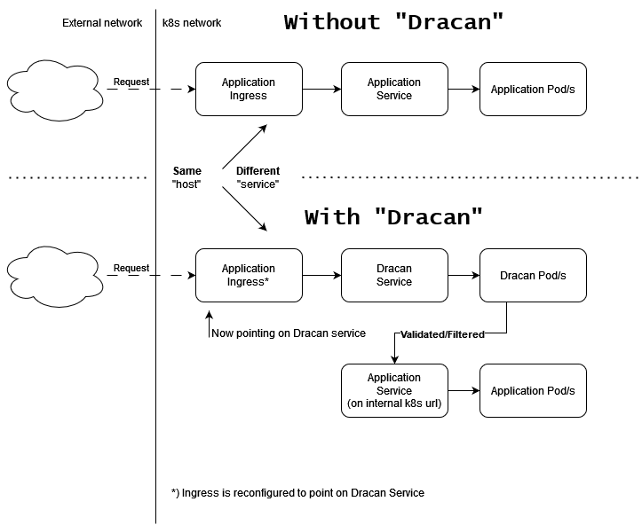

# Dracan example usage on k8s alike systems

## Concept



Dracan is a middleware service designed to operate between external Kubernetes Ingress endpoints and internal services within a Kubernetes cluster. It intercepts all incoming traffic and applies validation, request limiting, and URL/path restrictions before forwarding requests to designated internal services.

## Quick Setup Guide

### Prerequisites

- **Kubernetes Cluster**: Ensure a Kubernetes environment with Ingress Controller support (e.g., NGINX Ingress).
- **Docker Image**: Build the `dracan` image and push it to a registry accessible by the cluster.

### Steps

1. **Prepare required Configuration Files**
   - `proxy_config.json`: Configure the internal cluster service URL where requests should be proxied after validation.
   - `rules_config.json`: Define allowed methods, JSON schema, URI restrictions, rate limits, and payload size limits.

2. **Create ConfigMaps**
   - Create ConfigMaps from the JSON configuration files to mount them as volumes in the Dracan deployment.
   ```bash
   kubectl apply -f proxy-config-configmap.yaml
   kubectl apply -f rules-config-configmap.yaml
   kubectl apply -f dracan-env.yaml
   # or in one file
   kubectl apply -f configmaps.yaml # present in example
   ```

3. **Deploy Dracan**
   - Apply the `deployment.yaml` and `service.yaml` files to deploy Dracan and service for it:
   ```
   kubectl apply -f deployment.yaml
   kubectl apply -f service.yaml
   ```

4. **Set Up Ingress**
   - Configure Ingress to route traffic from your application URL to Dracan:
   ```yaml
   apiVersion: networking.k8s.io/v1
   kind: Ingress
   metadata:
     name: <your_app_ingress>
   spec:
     rules:
     - host: <your_app_url>
       http:
         paths:
         - path: /
           pathType: Prefix
           backend:
             service:
               name: dracan-service # Here change this Ingress to point to Dracan Service
               port:
                 number: 5000
   ```
   - Replace `your_app_url` with your public-facing domain or subdomain.
   - In `proxy_config.json` insert k8s internal DNS for service of your application, for example `app_name.namespace.svc.cluster.local`, correct `port` number and path on which service is listening (if applicable).

## Usage

After deployment:
- Dracan listens at `your_app_url`, intercepting all incoming requests.
- Based on the `rules_config.json` configuration, Dracan validates requests, limits rates, and restricts URIs before forwarding them to the internal application.
- Requests not conforming to rules are rejected with appropriate error responses.

**Dracan’s role as middleware ensures all requests are safe and compliant before reaching your application services.**
